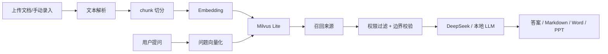

# BoundaryRAG

一个强调“知识库边界感”的 RAG MVP。

它不只是“上传文档然后问答”，而是把下面几件事都做完整了：

- 多知识库隔离：所有检索、问答、生成都必须绑定 `knowledge_base_id`
- 租户隔离：通过 `tenant_id` 避免跨租户访问
- 权限隔离：通过 `permission_tags` 控制文档、来源和生成物可见性
- 真实 RAG：文档切分、向量化、Milvus Lite 召回、再交给大模型生成
- 可追溯：答案、来源、命中分数、原文预览、生成历史都保留

## 技术栈

- 后端：Python 3.11、FastAPI、Uvicorn
- 数据模型：Pydantic v2
- 认证：Demo Header / JWT(HS256)
- 向量化：DashScope `MultiModalEmbedding` 或本地 hash embedding
- 大模型：DeepSeek Chat Completions 或本地 boundary LLM
- 向量存储：Milvus Lite 本地文件模式
- 业务存储：JSON 文件
- 文件解析：python-docx、python-pptx
- 前端：原生 HTML / CSS / JavaScript
- 测试：pytest、pytest-asyncio

## 架构

```text
浏览器
  -> FastAPI
    -> 文档解析 / 切分
    -> Embedding
    -> Milvus Lite 向量召回
    -> 权限过滤 / 边界校验
    -> LLM 生成回答或文档
    -> 返回答案、来源和生成物
```



## 核心能力

### 1. 知识库边界

- 每个 API 都要求 `kb_id`
- 检索结果只允许来自当前知识库
- 生成技能只能调用当前知识库允许的技能

### 2. 真正的 RAG

- 文档先切分成 chunk
- chunk 先向量化，再写入本地 Milvus Lite
- 问题也会向量化
- 先做相似度召回，再交给大模型生成

### 3. 可视化状态

- 文档状态：`indexing` / `indexed` / `failed`
- 失败原因常驻
- 支持重试索引
- 生成历史支持预览、下载、复制链接、删除、重新生成

## 数据存储

### 业务元数据

使用 `.rag_data/*.json` 保存：

- `knowledge_bases.json`
- `documents.json`
- `artifacts.json`

### 向量索引

使用本地 Milvus Lite：

```text
.rag_data/milvus_lite.db
```

默认 collection：

```text
boundaryrag_chunks
```

旧版本如果有 `chunks.json`，启动时会自动迁移到 Milvus Lite。

## 本地启动

### 1. 安装依赖

```bash
python -m venv .venv
source .venv/bin/activate
pip install -e ".[dev]"
```

### 2. 启动服务

```bash
uvicorn rag_demo.app:app --reload
```

### 3. 打开页面

```text
http://127.0.0.1:8000/
```

说明：

- 前端没有单独的 npm 启动命令
- FastAPI 直接托管 `rag_demo/web/`
- 直接打开 `file://` 也能看静态页面，但推荐走 `http://127.0.0.1:8000/`

## 环境变量

复制 `.env.example` 为 `.env` 后可配置真实模型：

```bash
EMBEDDING_PROVIDER=dashscope
DASHSCOPE_API_KEY=你的 DashScope Key
DASHSCOPE_EMBEDDING_MODEL=tongyi-embedding-vision-flash-2026-03-06

LLM_PROVIDER=deepseek
DEEPSEEK_API_KEY=你的 DeepSeek Key
DEEPSEEK_MODEL=deepseek-v4-pro
DEEPSEEK_BASE_URL=https://api.deepseek.com

RAG_DATA_DIR=.rag_data
RAG_ARTIFACT_DIR=.rag_data/artifacts
RAG_MILVUS_URI=.rag_data/milvus_lite.db
RAG_MILVUS_COLLECTION=boundaryrag_chunks
RAG_MAX_DOCUMENT_CHARS=200000
RAG_UPLOAD_PARSE_TIMEOUT_SECONDS=10

RAG_AUTH_MODE=jwt
RAG_JWT_SECRET=换成足够长的随机密钥
```

## 认证方式

### Demo 模式

通过请求头模拟身份：

```bash
X-User-Id: demo-user
X-Tenant-Id: default
X-Permission-Tags: hr,finance
```

### JWT 模式

使用 Bearer Token，Token 中需要包含：

- `sub` / `user_id`
- `tenant_id`
- `permission_tags`
- `exp`

## 接口速览

### 知识库

- `POST /knowledge-bases`
- `GET /knowledge-bases`

### 文档

- `POST /knowledge-bases/{kb_id}/documents`
- `POST /knowledge-bases/{kb_id}/documents/upload`
- `GET /knowledge-bases/{kb_id}/documents`
- `GET /knowledge-bases/{kb_id}/documents/{document_id}`
- `POST /knowledge-bases/{kb_id}/documents/{document_id}/reindex`
- `DELETE /knowledge-bases/{kb_id}/documents/{document_id}`

### 问答

- `POST /knowledge-bases/{kb_id}/query`

### 生成

- `POST /knowledge-bases/{kb_id}/skills/{skill_name}`
- `GET /knowledge-bases/{kb_id}/artifacts`
- `GET /knowledge-bases/{kb_id}/artifacts/{artifact_id}/preview`
- `GET /knowledge-bases/{kb_id}/artifacts/{artifact_id}/download`
- `DELETE /knowledge-bases/{kb_id}/artifacts/{artifact_id}`

### 运行状态

- `GET /health`
- `GET /runtime-config`

## 文档切分与命中

### 切分

- 默认按 700 字符切 chunk
- chunk 之间保留 80 字符 overlap
- 优先在换行、`。`、`.` 处切分

### 命中

每个 chunk 的最终分数：

```text
score = vector_score + lexical_score
```

- `vector_score`：Milvus Lite 余弦相似度召回结果
- `lexical_score`：关键词/字符片段命中分

### 生成

- 问答会把召回来源交给 LLM
- 生成技能会在当前知识库内先召回，再输出 Markdown / Word / PPT
- 结果会保存为 artifact，并生成下载链接

## 文件上传

支持：

- `.md`
- `.markdown`
- `.docx`
- `.pptx`

安全控制：

- 限制上传大小
- 限制解析超时
- Office 文件会做 zip 安全检查
- 解析失败会落库为 `failed`

## 测试

```bash
pytest -q
```

## 你会看到的效果

- 文档上传后会自动切分并入库 Milvus Lite
- 问答会优先只用当前知识库的内容回答
- 来源卡片可以直接打开原文
- 生成结果可以预览、下载、复制链接、删除和重写

## 说明

- 这个项目的定位是 MVP，但向量层已经规范化为本地 Milvus Lite
- 如果后续要上生产，可以把 JSON 业务存储进一步替换为数据库
- 如果你想继续扩展，我建议下一步做 rerank、流式输出和后台索引队列
