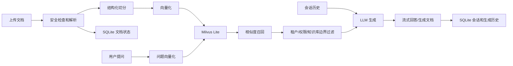

# BoundaryRAG


BoundaryRAG 是一个强调“知识库边界”的本地 RAG 项目。它的目标不是简单地把文档塞给大模型，而是把知识库隔离、租户权限、文档索引、向量召回、流式问答、会话上下文和文档生成串成一条可验证的闭环。

## 项目解决的问题

- 用户级隔离：每个登录用户只能看到自己创建的知识库、文档、会话和生成历史，管理员也不默认跨用户查看数据。
- 多知识库隔离：所有文档、检索、问答、生成都绑定 `knowledge_base_id`，避免串库回答。
- 租户隔离：通过 `tenant_id` 控制知识库、文档、会话和生成物归属。
- 权限隔离：通过 `permission_tags` 控制文档、召回结果和生成物可见范围。
- 真实 RAG：上传文档后会切分、向量化、写入 Milvus Lite；提问时也会向量化并做相似度召回，再交给 LLM 生成。
- 可追踪状态：文档索引状态、失败原因、重试、生成历史、会话历史都会落到本地数据库。
- 本地可运行：SQLite 保存业务数据，Milvus Lite 保存向量数据，不依赖外部数据库服务即可启动。

## 项目亮点

### 长时间无法返回内容怎么办

传统问答接口经常要等 LLM 完整生成后才一次性返回，用户会觉得页面“卡死”。BoundaryRAG 对问答链路做了流式输出和中断保护：

- 后端提供 `POST /knowledge-bases/{kb_id}/query/stream`，DeepSeek 模式下使用 `stream=true` 实时返回 token。
- 前端通过 `ReadableStream` 边接收边渲染，用户不需要等完整答案生成完才看到内容。
- 如果用户快速切换知识库或重新提问，前端会 `abort` 旧请求，避免旧知识库的旧响应覆盖当前页面。
- DeepSeek 流式请求设置了连接和读取超时，服务端异常会以“生成中断”文本返回，避免一直无感等待。
- 上传解析也设置了超时，超时会把文档状态落为 `failed` 并保留失败原因，用户可以重试索引。

### RAG 知识库边界如何定义

这个项目里的“边界”不是一个前端概念，而是贯穿数据、检索、生成和权限的约束：

- 知识库边界：每个 API 都带 `kb_id`，文档、chunk、会话、生成物都绑定 `knowledge_base_id`。
- 向量边界：Milvus Lite 查询时使用 `knowledge_base_id` 和 `tenant_id` 过滤，只召回当前知识库的数据。
- 用户边界：知识库写入 `owner_user_id`，列表、文档、会话和生成历史都按当前登录用户过滤。
- 租户边界：`tenant_id` 不一致时不能创建、读取或生成，防止跨租户访问。
- 权限边界：文档和生成物可以设置 `permission_tags`，用户权限不足时看不到对应内容。
- 技能边界：每个知识库通过 `allowed_skills` 控制是否允许问答、写文档、生成 Markdown、Word 或 PPT。
- 清理边界：删除知识库时会同步删除 SQLite 业务数据、Milvus chunk 和本地生成文件。

### Word 和 PPT 文档如何生成

Word/PPT 不是把原文简单拼接成文件，而是走一条“检索增强生成”链路：

- 用户选择 `write_word` 或 `write_ppt` 技能并输入生成要求。
- 后端先校验当前知识库是否授权该技能。
- 系统在当前知识库内对用户要求做向量召回，并进行租户和权限过滤。
- LLM 基于召回片段生成结构化内容，如果资料不足会说明缺口。
- `write_word` 使用 `python-docx` 把标题、段落、项目符号写成 `.docx`。
- `write_ppt` 使用 `python-pptx` 生成封面页、章节页和要点页。
- 生成物保存到 `.rag_data/artifacts`，同时把文件名、技能、指令、权限和下载地址写入 SQLite。

## 技术栈

| 层级 | 技术 |
| --- | --- |
| 后端 | Python 3.11、FastAPI、Uvicorn、Pydantic v2 |
| 前端 | Vue 3、Vite、组件化工作台 |
| 认证 | 账号密码登录、Redis session token、JWT HS256、Demo Header |
| 业务存储 | SQLite |
| 缓存 / 会话短状态 | Redis |
| 向量存储 | Milvus Lite，本地文件模式 |
| 向量模型 | DashScope `MultiModalEmbedding` 或本地 hash embedding |
| 大模型 | DeepSeek Chat Completions 或本地 boundary LLM |
| 文档解析 | Markdown、python-docx、python-pptx |
| 生成能力 | Markdown、Word、PPT |
| 测试 | pytest、pytest-asyncio |

## 架构

```text
浏览器
  -> FastAPI
    -> 认证与访问上下文
    -> 用户级 owner 边界
    -> SQLite 业务元数据
    -> 文档解析 / 安全检查 / 超时控制
    -> 结构化切分 / parent-child chunk
    -> Embedding
    -> Milvus Lite 向量写入与召回
    -> 权限过滤 / 边界校验
    -> DeepSeek 或本地 LLM
    -> 流式问答 / 文档生成 / 会话历史
```



## 核心能力

### 知识库边界

- 每个知识库都有独立的 `id`、`tenant_id`、`permission_tags` 和 `allowed_skills`。
- 每个新建知识库都会记录 `owner_user_id`，后端按当前 `user_id` 过滤，不依赖前端隐藏。
- 删除知识库时会同步清理该知识库下的文档、向量 chunk、会话和生成物。
- 问答、文档生成、预览、下载都只在当前知识库和当前访问权限内执行。

### 文档索引

- 支持手动录入文本，也支持上传 `.md`、`.markdown`、`.docx`、`.pptx`。
- 上传文件会做大小限制、Office zip 安全检查、压缩比检查、路径穿越检查和解析超时控制。
- 文档状态支持 `indexing`、`indexed`、`failed`。
- 索引失败会把失败原因落库，并支持重新索引。

### RAG 问答

- 文档入库时：解析文本、结构化切分、向量化、写入 Milvus Lite。
- 用户提问时：问题向量化、Milvus Lite 相似度召回、权限过滤、词法补分、LLM 生成。
- DeepSeek 模式下使用 `stream=true` 返回流式内容。
- 前端问答区默认不展示来源卡片，来源仅作为内部 RAG 依据和后端返回数据使用。
- 会话会保存上下文，刷新页面后可以继续查看历史对话。
- 账号密码登录会把 session token 写入 Redis，退出登录会删除 Redis session；JWT 退出时会写入 Redis 黑名单。

### 登录页与用户隔离

- 启动后先进入独立登录页，登录后才会打开主工作台。
- 支持账号密码登录、JWT 登录和演示身份登录，登录态按 `user_id + tenant_id + permission_tags` 划分本地命名空间。
- 普通用户和管理员都默认只能看到自己创建的知识库；管理员角色不等于跨用户可见。
- 最近知识库、历史对话、当前知识库、筛选条件都会按用户隔离保存，不会串到其他登录用户。
- 退出登录会回到登录页，并清理当前会话态。

### 文档生成

- 支持 `write_document`、`write_markdown`、`write_word`、`write_ppt` 等技能。
- 生成前会先在当前知识库内召回资料，再让 LLM 基于召回内容生成。
- 生成物会保存为 artifact，支持预览、下载、复制链接、删除和重新生成。

## 数据存储

### SQLite 业务数据库

默认路径：

```text
.rag_data/boundaryrag.sqlite3
```

主要保存：

- `knowledge_bases`：知识库、租户、权限和允许技能。
- `users`：账号、密码哈希、角色、租户和权限标签。
- `documents`：文档正文、索引状态、失败原因和元数据。
- `artifacts`：生成物记录和下载信息。
- `conversations`：会话列表。
- `conversation_messages`：用户和助手消息。
- `operation_events`：上传、索引、删除等操作事件。

### Milvus Lite 向量库

默认路径：

```text
.rag_data/milvus_lite.db
```

默认 collection 前缀：

```text
boundaryrag_chunks
```

Milvus 存储字段包括：

- `id`
- `knowledge_base_id`
- `document_id`
- `title`
- `text`
- `metadata_json`
- `tenant_id`
- `permission_tags_json`
- `embedding`
- `created_at`

不同 embedding 维度会使用带维度后缀的 collection，例如 `boundaryrag_chunks_d384`。

### Redis 短期状态

默认路径不是本地文件，而是独立 Redis 服务：

```text
redis://localhost:6379/0
```

当前项目把 Redis 用在：

- 账号密码登录 session token，默认 TTL 86400 秒。
- JWT 退出登录黑名单
- 后续可扩展的限流、短期缓存、任务状态

Redis 只保存短期状态，不替代 SQLite 的业务实体化存储。

## 文档处理与切分

### 当前已实现

- Markdown 标题识别：按 `#` 到 `######` 建立 `heading_path`。
- 段落切分：优先按空行、换行和标点边界切分。
- 代码块保护：识别 fenced code block，避免把代码块随意打碎。
- parent-child chunk：先生成 parent，再把 parent 切成 child chunk。
- chunk metadata 补全：记录 `parent_id`、`parent_index`、`child_index`、`heading_path`、`heading`、`block_types`、`split_strategy`。
- Word/PPT 表格文本化：把表格单元格用 ` | ` 拼接成可检索文本。

默认切分参数：

```text
parent: 2400 chars
child: 700 chars
overlap: 80 chars
```

### 尚未实现或可继续增强

- OCR：当前没有识别图片内文字。
- 语义聚类切分：当前是结构化边界加规则切分，还不是基于 embedding topic shift 的语义切分。
- 完整 Markdown 表格规范化：当前是文本化表格，不是完整 Markdown table。
- 文档去重：当前没有全局文件 hash 和 chunk hash 去重策略。
- 更细 metadata：当前没有页码、字符偏移、parser 版本、文件 hash 等完整审计字段。

## 召回与生成流程

### 入库流程

```text
上传/录入文档
  -> 保存 document 记录为 indexing
  -> 解析和安全检查
  -> 结构化切分 chunk
  -> DashScope 或本地 embedding
  -> 写入 Milvus Lite
  -> 更新 document 状态为 indexed
  -> 失败时更新为 failed 并保存 error
```

### 问答流程

```text
用户问题
  -> 获取或创建 conversation
  -> 读取最近会话上下文
  -> 问题向量化
  -> Milvus Lite 按 kb_id + tenant_id 召回
  -> permission_tags 过滤
  -> vector_score + lexical_score 综合排序
  -> LLM 基于召回片段和会话上下文生成
  -> 流式返回答案
  -> 保存 user/assistant 消息
```

综合分数：

```text
score = vector_score + lexical_score
```

## 本地启动

### 1. 安装依赖

```bash
python -m venv .venv
source .venv/bin/activate
pip install -e ".[dev]"
```

### 2. 构建前端

前端源码在 `frontend/`，构建产物会写入 `boundary_rag/web/` 并由 FastAPI 托管。仓库里保留了最新构建产物；如果你修改过前端，或想从源码重新构建，请执行：

```bash
npm install
npm run build
```

### 3. 启动 Redis

账号密码登录会把登录 token 写入 Redis，并缓存 1 天。可以用 Docker Compose 启动：

```bash
docker compose up -d redis
```

也可以直接启动 Redis 容器：

```bash
docker run --name boundaryrag-redis -p 6379:6379 -d redis:7
```

### 4. 启动服务

然后启动 FastAPI：

```bash
uvicorn boundary_rag.app:app --reload
```

### 5. 打开页面

```text
http://127.0.0.1:8000/
```

前端由 FastAPI 直接托管 `boundary_rag/web/`，建议使用 `http://127.0.0.1:8000/`，不要直接使用 `file://` 测试接口能力。前端开发时可使用 `npm run dev` 启动 Vite，开发服务器已把后端 API 代理到 `http://127.0.0.1:8000`。

## 环境变量

复制 `.env.example` 为 `.env` 后配置真实模型。不要把真实密钥提交到 Git。

```bash
EMBEDDING_PROVIDER=dashscope
DASHSCOPE_API_KEY=你的 DashScope Key
DASHSCOPE_EMBEDDING_MODEL=tongyi-embedding-vision-flash-2026-03-06
DASHSCOPE_EMBEDDING_BATCH_SIZE=20

LLM_PROVIDER=deepseek
DEEPSEEK_API_KEY=你的 DeepSeek Key
DEEPSEEK_MODEL=deepseek-v4-pro
DEEPSEEK_BASE_URL=https://api.deepseek.com

RAG_DATA_DIR=.rag_data
RAG_ARTIFACT_DIR=.rag_data/artifacts
RAG_SQLITE_PATH=.rag_data/boundaryrag.sqlite3
RAG_MILVUS_URI=.rag_data/milvus_lite.db
RAG_MILVUS_COLLECTION=boundaryrag_chunks

RAG_MAX_UPLOAD_MB=25
RAG_MAX_ARCHIVE_MEMBERS=512
RAG_MAX_ARCHIVE_UNCOMPRESSED_MB=100
RAG_MAX_ARCHIVE_COMPRESSION_RATIO=100
RAG_MAX_DOCUMENT_CHARS=200000
RAG_UPLOAD_PARSE_TIMEOUT_SECONDS=10

RAG_AUTH_MODE=jwt
RAG_JWT_SECRET=换成足够长的随机密钥
RAG_JWT_ISSUER=
RAG_JWT_AUDIENCE=
RAG_JWT_LEEWAY_SECONDS=30
RAG_AUTH_SESSION_TTL_SECONDS=86400

RAG_REDIS_ENABLED=true
RAG_REDIS_URL=redis://localhost:6379/0
RAG_REDIS_KEY_PREFIX=boundaryrag
RAG_REDIS_TIMEOUT_SECONDS=1
RAG_REDIS_DEFAULT_TTL_SECONDS=86400
```

## 认证方式

### 默认账号密码登录

项目启动时会在 SQLite `users` 表中写入两个账号，密码只保存 PBKDF2 哈希，不保存明文：

| 用户名 | 密码 | 角色 |
| --- | --- | --- |
| `rag_user` | `rag_user123456` | 管理员 |
| `lcz10086` | `lcz123456` | 普通用户 |

登录流程：

```text
用户名/密码
  -> POST /auth/login
  -> SQLite 校验 users 表
  -> 生成 Bearer token
  -> Redis 写入 token session，TTL 86400 秒
  -> 前端后续请求携带 Authorization: Bearer <token>
```

用户级隔离规则：

- `lcz10086` 只能看到 `lcz10086` 创建的知识库。
- `rag_user` 也只能看到 `rag_user` 创建的知识库。
- 管理员角色主要用于自己账号空间内的管理能力和权限标签豁免，不代表可以默认读取其他用户的知识库。
- 这个隔离由后端 `owner_user_id == 当前 user_id` 强制校验，前端只做展示配合。

### 兼容 JWT / Demo

- 如果你想快速做一个标准 REST API，`FastAPI` 自带的 `OAuth2PasswordBearer` + JWT 就够用。
- 如果你想要现成的注册、登录、注销、重置密码、用户管理，`FastAPI Users` 更省事。
- 如果你要接企业单点登录或第三方登录，`Authlib` 更合适，尤其是 OIDC/OAuth2 场景。
- 这个项目当前采用“账号密码 + Redis session token”为主，同时保留 Demo Header 和 JWT Bearer 兼容能力，便于测试和后续企业登录扩展。

### Demo 模式

默认 `RAG_AUTH_MODE=demo`，通过请求头模拟身份：

```bash
X-User-Id: demo-user
X-Tenant-Id: default
X-Permission-Tags: hr,finance
```

### JWT 模式

设置 `RAG_AUTH_MODE=jwt` 后使用 Bearer Token。Token 中建议包含：

- `sub` 或 `user_id`
- `tenant_id`
- `permission_tags`
- `exp`

如果配置了 `RAG_JWT_ISSUER` 或 `RAG_JWT_AUDIENCE`，后端会校验 issuer 和 audience。

如果启用了 Redis，退出登录会同时把当前 JWT 加入 Redis 黑名单，后续同一 token 会被拒绝。

## API 速览

### 运行状态

- `GET /health`
- `GET /runtime-config`
- `POST /auth/login`
- `POST /auth/logout`
- `GET /operation-events`

### 知识库

- `POST /knowledge-bases`
- `GET /knowledge-bases`
- `DELETE /knowledge-bases/{kb_id}`

知识库 ID 必须满足：

```text
^[a-zA-Z0-9_-]{2,64}$
```

### 文档

- `POST /knowledge-bases/{kb_id}/documents`
- `POST /knowledge-bases/{kb_id}/documents/upload`
- `GET /knowledge-bases/{kb_id}/documents`
- `GET /knowledge-bases/{kb_id}/documents/{document_id}`
- `POST /knowledge-bases/{kb_id}/documents/{document_id}/reindex`
- `DELETE /knowledge-bases/{kb_id}/documents/{document_id}`

### 问答和会话

- `POST /knowledge-bases/{kb_id}/query`
- `POST /knowledge-bases/{kb_id}/query/stream`
- `GET /knowledge-bases/{kb_id}/conversations`
- `GET /knowledge-bases/{kb_id}/conversations/{conversation_id}/messages`

流式接口会通过响应头返回：

```text
X-Conversation-Id: conv_xxx
```

### 生成

- `POST /knowledge-bases/{kb_id}/skills/{skill_name}`
- `GET /knowledge-bases/{kb_id}/artifacts`
- `GET /knowledge-bases/{kb_id}/artifacts/{artifact_id}/preview`
- `GET /knowledge-bases/{kb_id}/artifacts/{artifact_id}/download`
- `DELETE /knowledge-bases/{kb_id}/artifacts/{artifact_id}`

可用技能：

- `answer_question`
- `write_document`
- `write_markdown`
- `write_word`
- `write_ppt`

## 前端能力

- 独立账号密码登录页，登录后再进入主工作台。
- 左侧支持知识库搜索、最近使用、当前知识库边界摘要。
- 创建知识库是次要操作，不会挤占主要使用路径。
- 问答、文档、生成、设置页面分区展示，避免结果串页。
- 文档列表支持搜索、状态筛选、权限标签筛选和创建时间排序。
- 文档状态以颜色标签展示，并常驻展示失败原因和重试入口。
- 问答支持流式输出和历史对话面板。
- 登录状态卡片展示用户、角色、租户、权限、过期时间和退出入口。
- 顶部功能按钮尺寸固定，切换页面时不会变形。

## 测试

```bash
python -m compileall -q boundary_rag
npm run build
pytest -q
```

## 常见问题

### 创建知识库时报 ID 格式错误

知识库 `id` 只能使用英文、数字、下划线和中划线，长度 2 到 64，例如：

```text
finance_kb
hr-policy
kb_001
```

### DashScope 报 contents count exceeds limit

DashScope embedding 单批最多 20 条内容。项目通过 `DASHSCOPE_EMBEDDING_BATCH_SIZE=20` 分批请求，建议不要把这个值调大。

### 页面能打开但接口不工作

请使用：

```text
http://127.0.0.1:8000/
```

不要直接用 `file:///.../index.html` 测试完整功能。

### 是否必须安装独立 Milvus 服务

不需要。当前使用 `pymilvus[milvus-lite]` 的本地文件模式，向量库保存在 `.rag_data/milvus_lite.db`。

## 本地数据说明

以下路径是本地运行数据，不应该提交到 Git：

```text
.env
.rag_data/
__pycache__/
.pytest_cache/
```

`.env` 只保存你自己的本地密钥，README 和示例配置只保留占位符。
